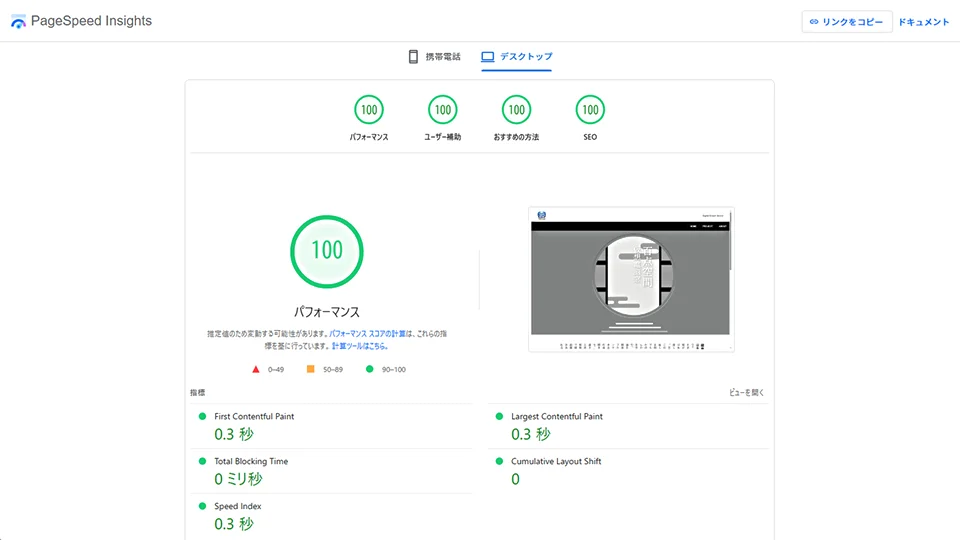
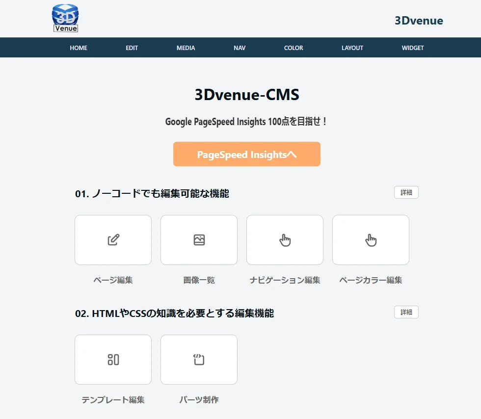
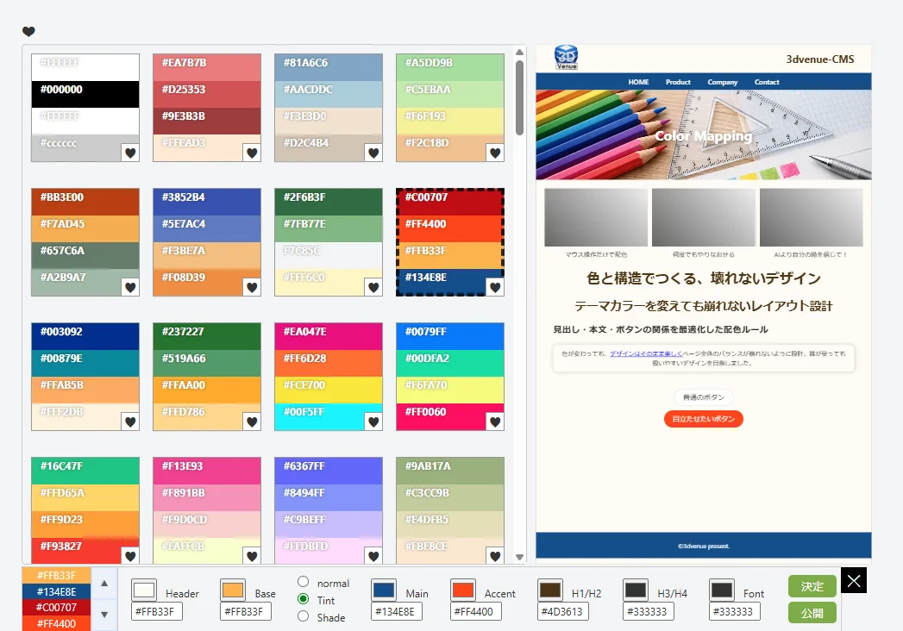
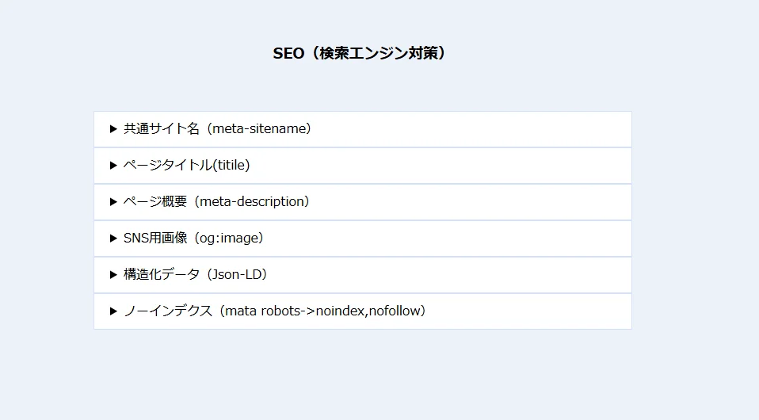

# 3Dvenue-CMS VHN(Visual HTML Noter)

I wanted to achieve perfect PageSpeed Insights scores, so I built my own CMS.

PageSpeed Insightsで「ALL 100点」を狙いたくて、このCMSを開発しました。


## Lightweight Structure

- Public side: approximately 194KB
- Entire system: under 1.12MB

Including the admin panel, SQLite database, SEO tools, and color mapping system.


## バージョン履歴 / Version History

### v0.9.9
- Added MP3 playback support
  mp3 再生機能を追加
- Added 3D model (GLB) viewer support
  3D Model(GLB)表示機能を追加  
- Improved editor functionality
  エディター機能の一部改善
  
### v0.9.8
- PDFのアップロード、確認、ダウンロード機能追加  
  Added PDF upload, preview and download support

### v0.9.7
- ヘッダー・フッター編集機能を追加  
  Added Header and Footer Editor

### v0.9.6
- 多言語機能を拡張  
  Expanded multilingual features

- アクセス解析ページを追加  
  Added access analytics page

- 管理画面UIを改善  
  Improved admin UI


### v0.9.5
- 多言語対応機能を追加  
  Added multilingual support

- GUIデザインを改良  
  Improved GUI design

- 数か所のバグを修正  
  Fixed several bugs


### v0.9.0
- 初回公開版リリース  
  Initial public release

- 軽量CMS構造を実装  
  Implemented lightweight CMS structure

- SQLite対応  
  SQLite support

- SEOツールを搭載  
  Included SEO tools


# About the Developer
## 開発者について

こんにちは、開発者の村井芳裕です。  

私は、まだ日本の大手企業ですらホームページ保有率が10数%程度だった頃から、WEBシステム開発を続けてきたエンジニアです。  
気が付けば66歳になっていましたが、今でも手書きでHTMLを書きながら開発を続けています。  

長年、中小企業向けのWEB制作やシステム開発に関わる中で、数多くのCMSにも触れてきました。  
しかし、実際に使ってみると、

- 拡張性が低い
- 動作が重い
- 欲しい機能が思ったように作れない
- 管理が複雑になりすぎる

と感じることも多く、  
「それなら、自分が本当に使いたいCMSを、自分で作ろう」と考えて開発を始めたのが、この 3DVenue-CMS です。  

2026年4月1日に開発を開始し、本当は4月中に公開する予定でした。  
ですが、フルスタックで開発を進める中で、「あれも作りたい」「これも入れたい」と寄り道を繰り返しているうちに、気が付けば5月になっていました（笑）  

まだ評価版ではありますが、  
技術やセンスのある方に自由に改造していただき、より面白いCMSへ育ててもらえたら嬉しく思います。  

2026年5月9日  
Japan / Tokyo


  
## Features 

### Digital Dream Deliver (3D) Concept
### Digital Dream Deliver (3D) のコンセプト

Rather than being just another website creation tool, 3DVenue aims to provide an “experiential space” built around the idea of delivering dreams through the power of digital technology.

単なるウェブサイト制作ツールではなく、デジタルの力で夢を届けるという思想に基づいた「体験型スペース」を提供します。


### Optimized for a 100/100 PageSpeed Insights Score
### PageSpeed Insights ALL 100点への最適化

- **Focused on simple HTML and CSS**

  Rather than relying on excessive libraries, the system is designed around simple HTML structures and CSS to keep development lightweight and easy to control.


  - **自分が使いやすいHTMLとCSSへの集中**
  
    余計なライブラリに振り回されず、シンプルなHTML構造とCSSだけでデザインすることに重点を置いています。

- **Automatic WebP conversion for simpler image management**

  Simply uploading images automatically converts them to WebP format, significantly reducing file sizes.

  The goal is to create an environment optimized for fast rendering and high PageSpeed Insights scores, including the possibility of achieving 100/100 scores.

  *Some image adjustment features are still under development and will be improved in future updates.*


  - **画像管理の手間を省くWebP自動変換**
  
    画像をアップロードするだけですべてWebPに変換し、データサイズを大幅に縮小します。

    瞬時の表示と、高スコアでオール100点実現を目指す環境を作ってみました。

    *※画像のサイズ調整機能などは未完成のところもありますが、バージョンアップで完成させる予定です。*

- **SEO settings that can be adjusted in real time**

  SEO settings for each page can be configured directly without plugins.

  You can check results in PageSpeed Insights while adjusting settings in real time.

  - **チェックしながら調整できるSEO設定**
  
    プラグイン不要で各ページ毎のSEO設定を直接指定できます。

    PageSpeed Insightsでチェックしながら、リアルタイムに調整をすることができます。


### Flexible Deployment Powered by SQLite
### SQLiteの採用による、場所を選ばない自由な管理

- **Freedom from complicated database setup**

  By using SQLite, no complex database configuration is required.

  Since SQLite does not require a dedicated database server, the system can run easily in many hosting environments.

  Simply place the files in your preferred directory, and the system is ready to run immediately.


  - **DB設定のわずらわしさからの解放**
  
    SQLiteを使用しているため、面倒なデータベース設定を不要にしました。
    
    ※SQLiteはサーバーを必要としないDBのため多くの環境で利用が可能です。
    
    設定したい場所にファイルを置くだけですぐに動作します。

- **Publishing and migration completed simply by moving directories**

  For example, you can complete a website inside a `/close/` directory, and the moment you rename the directory to `/open/` via FTP, the site immediately becomes available at the new URL.

  The system continues to work even when moved to another directory or even another domain, making migration extremely simple.

  If the site is fully prepared before migration, transferring the administration environment is unnecessary.

  This may help reduce deployment and delivery work for professional developers.


  - **ディレクトリ移動だけで完結する「公開」と「移設」**
  
    たとえば `/close/` ディレクトリ内でページを完成させ、FTPでディレクトリ名を `/open/` に変えた瞬間にそのURLへ切り替わります。
    
    同じドメイン内だけでなく、別ドメインのどのディレクトリへ移動してもそのまま動作するので、移転作業が簡単に済みます。
    
    ※移転前にページを完成させておけば管理画面の転送は不要です。
    
    ※プロフェッショナルの納品の手間が軽減されるのではないでしょうか？


    
### Built-in Color Design Tool
### 色彩設計ツールの導入

- **Have you ever struggled with color combinations?**

  At least I certainly did over the years.

  To make color selection easier, I created a custom system based on four-color palettes that allows users to test up to 24×3 pattern combinations from a single palette while trying to avoid visually broken combinations as much as possible.


  - **配色で頭を悩ませていませんでしたか？**
  
    少なくても僕はこれが本当にしんどかったので、独自ロジックで、４色パレットを使って、出来るだけ破綻しない組み合わせを、１つのパレットだけで２４×３通りの組み合わせを試せる仕組みを作ってみました。


- **100 preset color palettes included**

  All colors can be freely customized and replaced.


  - **配色パレットを100種類用意**
  
    色は自由に差し替えが可能です。


- **Favorite filter feature**

  By marking color patterns with a ♥ icon, you can instantly filter and revisit your favorite combinations.


  - **お気に入り機能**
  
    配色パターンに♥マークをチェックすれば、クリック一つで絞り込めるようにしています。

- **Spend less time adjusting colors and more time building pages**

  Since color selection often leads to repeated revisions between clients and designers, I tried to create a system that allows visual simulation directly within the website image itself.


  - **時間短縮でページ作成に集中**
  
    ※配色はデザイナー任せで差戻しの繰り返しになることが多いので、サイトイメージを使ったシミュレーションが出来るようにしてみました。

*I spent far more time building this feature than I expected.
While developing it, I kept adding new ideas and improvements, and before I realized it, the release had been delayed.*

*この仕組みに結構時間がかかったので、投稿までに時間がかかってしまいました。使いやすさはバージョンアップか、利用してくださる皆さんのお力を借りれたらと*


## Screenshots

### PageSpeed Insights  
  



### Admin Panel  
  
  


  
### Color Mapping Tool  
  
  


  
### SEO Settings  
  
  
  


## Demo / How to Build

- **Step 1: TextEdit** https://vimeo.com/1190139385?fl=ip&fe=ec
    
- **Step 2: ImageSetup** https://vimeo.com/1190139478?fl=ip&fe=ec
    
- **Step 3: PageNameChange** https://vimeo.com/1190139559?fl=ip&fe=ec
    
- **Step 4: SEO** https://vimeo.com/1190139587?fl=ip&fe=ec
    
- **Step 5: ColorMapping** https://vimeo.com/1190139423?fl=ip&fe=ec
    
- **Step 6: Navigation** https://vimeo.com/1190139520?fl=ip&fe=ec


##  Installation / Usage

Upload the following files and directories to any directory on your web server.
以下のファイルとディレクトリ一式を、Webサーバー上の任意のディレクトリへアップロードしてください。  
  
/  
├─ index.php  
├─ .htaccess  
├─ favicon.ico  
├─ 3d_venue_data.qox  
├─ /common  
└─ /3dvenue

`/3dvenue` is the admin directory.
`/3dvenue` は管理画面ディレクトリです。


The default directory name is `/3dvenue`, however, you may freely rename it to `/admin`, `/tanaka`, or any other name, and it will continue to work normally.  

ディレクトリ名はデフォルトで `/3dvenue` になっていますが、  
`/admin` や `/tanaka` など、任意の名前へ変更しても正常に動作します。


Next, open `login.php` inside the administration directory and configure the following settings.  
次に、管理ディレクトリ内の `login.php` を開き、以下を設定してください。  
  
```php  
$acount = "your-account";  
$password = "your-password";    
```

Please change these values before uploading to a public server.
公開サーバーへアップロードする前に、必ず変更してください。

**This is all you need to get started.**
**この設定だけで動作します。**

_The entire system is approximately 1MB in size._  
_ファイル全体はおよそ1MB程度です。_


    
## License
  
### 3DVenue-CMS
3DVenue-CMS is a lightweight and high-performance CMS focused on simplicity, speed, and flexible deployment.

### License
Copyright (c) 2026 Yoshihiro Murai
Released under the MIT License.
https://opensource.org/licenses/MIT

## Third-Party Libraries

- Tabler Icons (MIT License)
  https://tabler.io/icons
