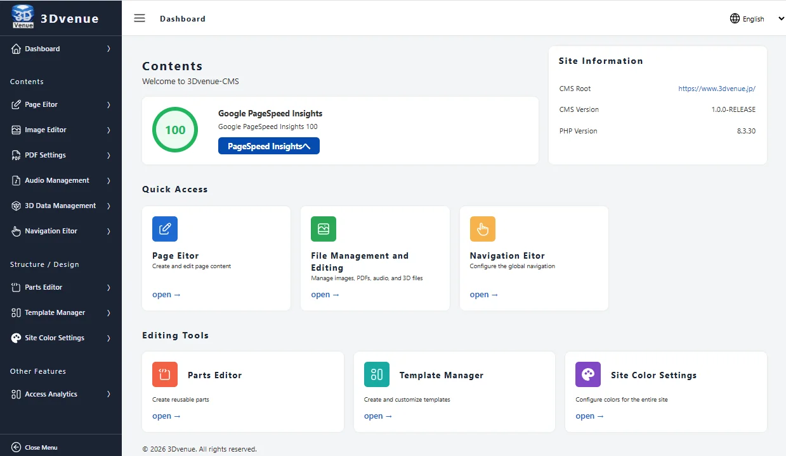
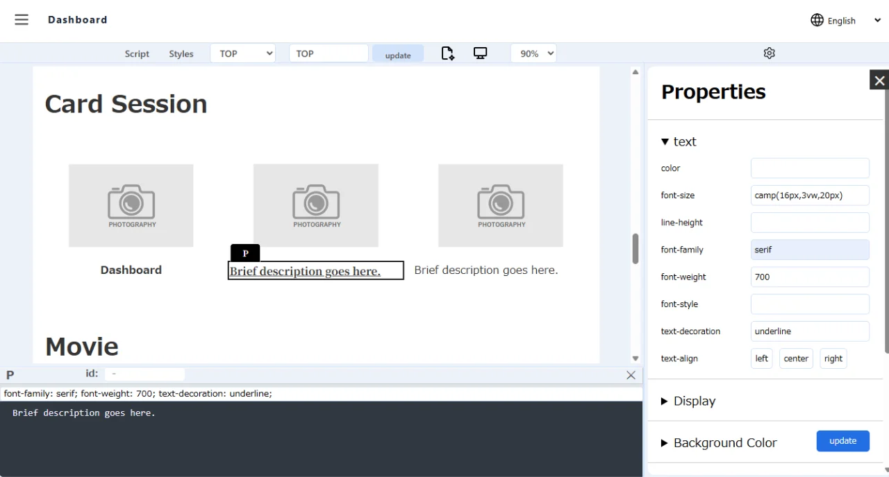
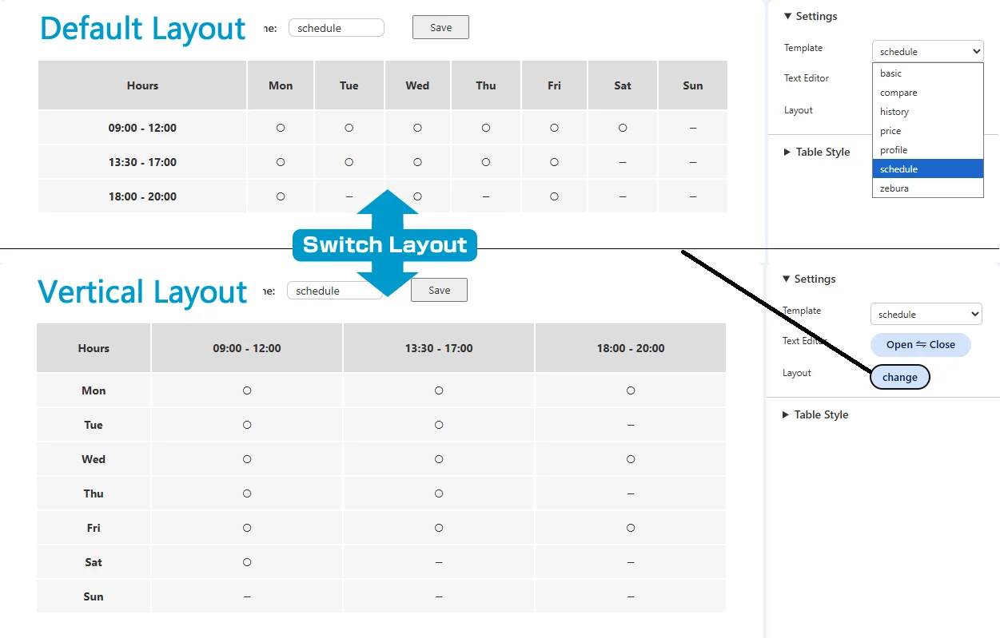
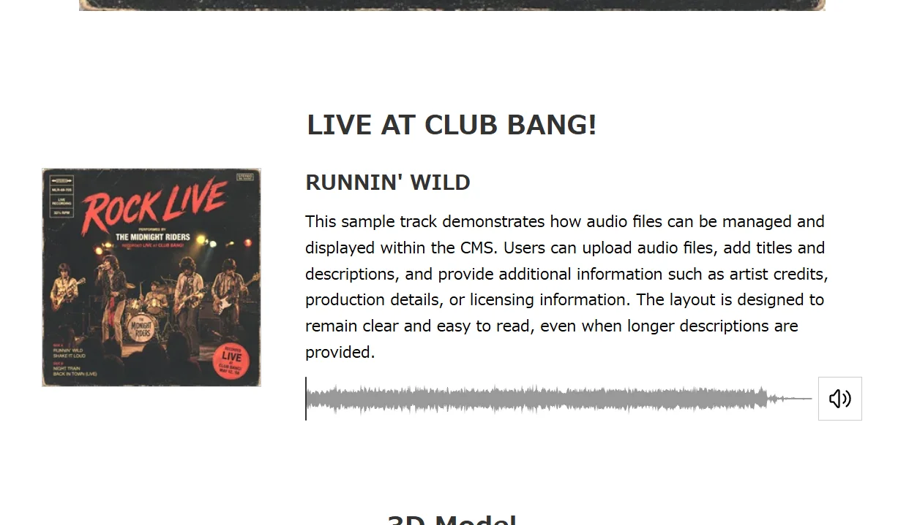
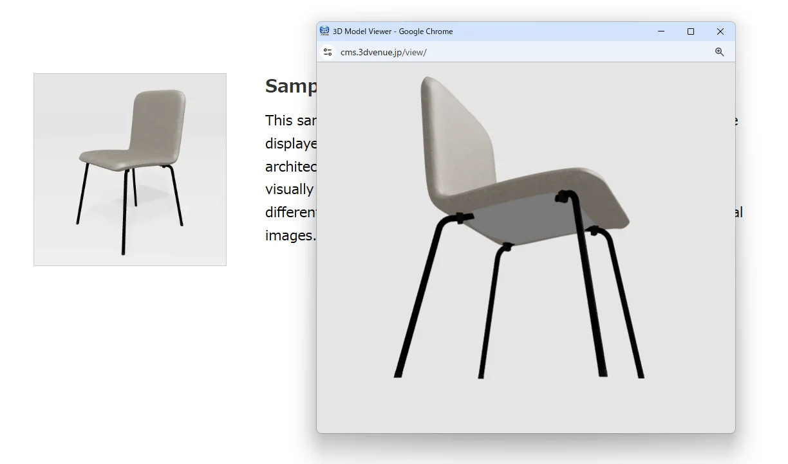
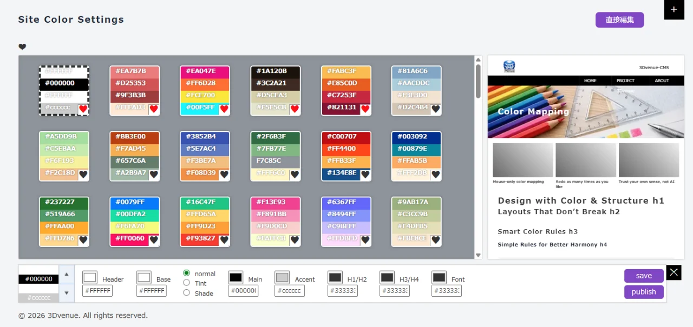
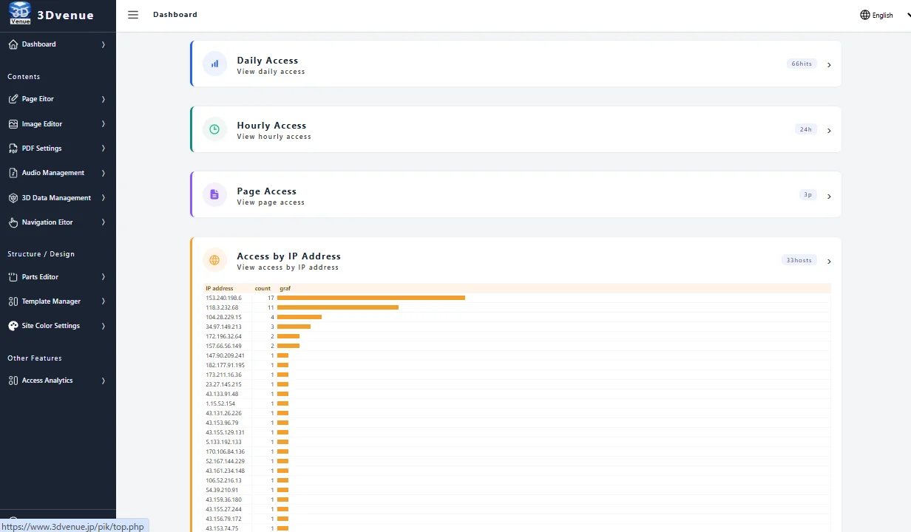

# 3Dvenue‑CMS

## **A CMS for those who want to build in their own style.**
### **Freedom adapts to you, becoming a CMS that is yours alone.**
**You’ll understand what it truly means once you start using it.**

## Features

- **Not for everyone. For professionals.**  
  Built for developers who want complete control.

- **Rules exist. But breaking them won't break your site.**  
  Freedom comes first.

- **No Select Boxes. Direct Input.**  
  Type CSS values directly.

- **No Database Setup.**  
  SQLite works automatically.

- **Install Anywhere.**  
  No configuration after moving your site.

- **Three Ways to Edit.**  
  Visual, HTML, or Properties.

- **Built-in MP3 & GLB Support.**  
  Upload and use them immediately.

- **No More Color Guesswork.**  
  A built-in color palette that stays in harmony.

- **No Pre-made Parts. Build Your Own.**  
  Create exactly what you need.

- **Minimal HTML Templates.**  
  Only the HTML your page actually needs.

- **Find Image Usage Instantly.**  
  Click an image to see where it's used.

- **Drag Navigation with Children.**  
  Move parent and child items together.

- **Built-in Table Editor.**  
  Create tables without writing HTML.

- **No Third-party Analytics.**  
  Simple analytics included.

- **Download in 10 Seconds.**  
  From GitHub to your editor.

- **Use What You Want. Ignore the Rest.**  
  You're in control.
## Installation

Upload the following files and directories to any directory on your web server.
`/`  
`├─ index.php`  
`├─ .htaccess`  
`├─ favicon.ico`  
`├─ 3d_venue_data.qox`  
`├─ /common`  
`└─ /3dvenue`
`└─ /view`

`/3dvenue` is the admin directory.

The default directory name is `/3dvenue`, however, you may freely rename it to `/admin`, `/tanaka`, or any other name, and it will continue to work normally.

Next, open `login.php` inside the administration directory and configure the following settings.

`$acount = "your-account";`  
`$password = "your-password";`

※Please change these values before uploading to a public server.

**This is all you need to get started.**

_The entire system is approximately 780KB in size._
## Screenshots

# Dashboard

# No selector Direct Input

# Table Editor

# MP3 Player

# 3D Viewer (glb)

# Color Palettes

# Access Analytics

## Requirements

- PHP 8.0 or later
- SQLite3
- Apache or Nginx
  
## Version History

### v1.0.0 release

- Initial public release – 2026-07-26

### v0.9.9

- Added MP3 playback support mp3 再生機能を追加
- Added 3D model (GLB) viewer support 3D Model(GLB)表示機能を追加
- Improved editor functionality エディター機能の一部改善

### v0.9.8

- PDFのアップロード、確認、ダウンロード機能追加  
    Added PDF upload, preview and download support

### v0.9.7

- ヘッダー・フッター編集機能を追加  
    Added Header and Footer Editor

### v0.9.6

- 多言語機能を拡張  
    Expanded multilingual features
    
- アクセス解析ページを追加  
    Added access analytics page
    
- 管理画面UIを改善  
    Improved admin UI
    

### v0.9.5

- 多言語対応機能を追加  
    Added multilingual support
    
- GUIデザインを改良  
    Improved GUI design
    
- 数か所のバグを修正  
    Fixed several bugs
    

### v0.9.0

- 初回公開版リリース  
    Initial public release
    
- 軽量CMS構造を実装  
    Implemented lightweight CMS structure
    
- SQLite対応  
    SQLite support
    
- SEOツールを搭載  
    Included SEO tools

## License

### 3DVenue-CMS

3DVenue-CMS is a lightweight and high-performance CMS focused on simplicity, speed, and flexible deployment.
### License

Copyright (c) 2026 Yoshihiro Murai Released under the MIT License. [https://opensource.org/licenses/MIT](https://opensource.org/licenses/MIT)

## Third-Party Libraries

- jQuery (MIT License) [https://jquery.com/](https://jquery.com/?utm_source=chatgpt.com)
- jQuery UI (MIT License) [https://jqueryui.com/](https://jqueryui.com/?utm_source=chatgpt.com)
- Tabler Icons (MIT License) [https://tabler.io/icons](https://tabler.io/icons)
- Three.js (MIT License) [https://threejs.org](https://threejs.org/)
- PDF.js (Apache License 2.0) [https://mozilla.github.io/pdf.js/](https://mozilla.github.io/pdf.js/)
  
  